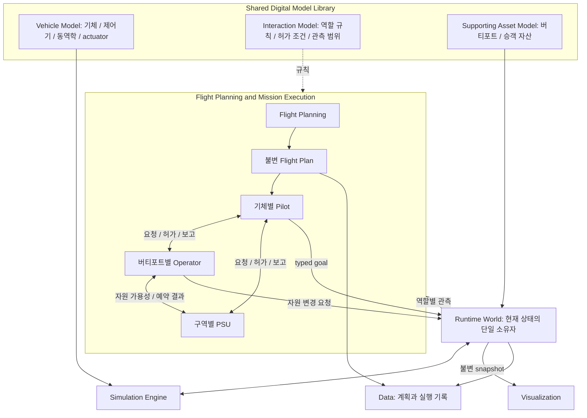
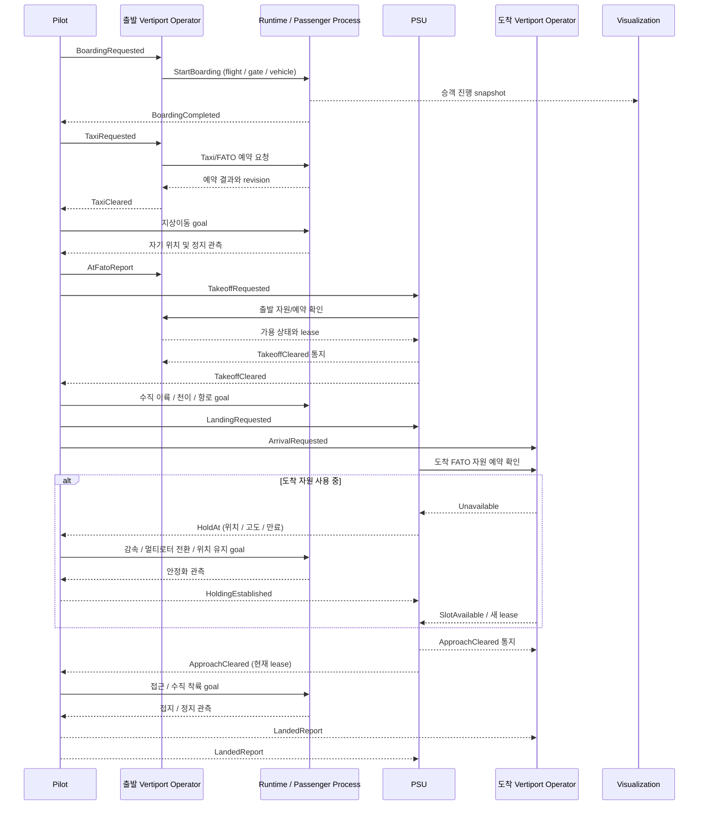

# 비행계획과 운항 실행의 분리

2026-09-10. 이 문서는 **이번에 연결한 코드**와 **다음 단계의 설계**를 구분한다.
아래 PSU 역할은 AeroDT 시뮬레이션에서 채택할 역할 분담이며 실제 항공 관제 권한이나 제도에 대한 설명이 아니다.

## 1. 아키텍처 그림의 변경 제안

기체가 명령에 따라 어떻게 움직이는가는 기존 **High-Fidelity Aerospace Vehicle Model**에 그대로 둔다.
조종사 행위와 자동비행 제어기는 다른 것이다. 조종사는 허가와 관측을 보고 목표를 정하고,
Flight Control & Navigation Model의 SimpleFlight는 그 목표를 추력과 자세 명령으로 바꾼다.

기존 Interaction Model은 없애지 않고 다음 두 묶음으로 확장한다.

- Physical Interaction Models: 접촉, 장애물, 기체와 환경의 상호작용.
- Operational Interaction Models: 역할별 행동 규칙, 관측 범위, 허가 조건, 요청과 보고의 정의.

**라이브러리에는 규칙과 파라미터를 두고, 활동 중인 조종사나 PSU 객체는 두지 않는다.**
Shared Digital Model Library 옆에는 **Flight Planning & Mission Execution** 상자를 추가하는 안을 제안한다.
상자 안에서도 `Flight Planning`과 `Stakeholder Execution`은 독립된 부분이다.
계획 생성은 실행 승인이나 자원 예약을 의미하지 않는다.

그림의 Stakeholder Execution 중 실제 경로 추종 Pilot과 시설별 자원 보고 경계가
연결됐다. 각 `VertiportOperator`가 자기 시설의 점유·예약·운영 상태를
`VertiportResourceReport`로 발행하며 PSU는 보고 모니터를 통해서만 이를 읽는다.
운영 화면의 폐쇄·재개 명령 연결과 역할별 전체 허가 API는 아래 설계를 기준으로
후속 구현한다.
현재 `user_application/uam_mission`이 계획 및 임무 의도를 맡는다는 기존 경계도 유지한다.
향후 예측 플래너를 추가하면 ai_pnp가 후보 계획을 만들고 같은 Flight Plan 계약으로 제출하면 된다.

## 2. 이번에 실제로 분리한 코드

| 구성 요소 | 코드 | 맡는 일 | 하지 않는 일 |
|---|---|---|---|
| FlightPlanning | user_application/uam_mission/flight_planning.py | 시설과 항로를 읽고 계획 검증 및 저장 | 물리 실행, 이륙 허가 |
| FlightPlans | data/simulation/flight_plans.py | 불변 계획 문서, ID, 내용 해시, 재조회 | 계획 수정, 실시간 상태 소유 |
| FlightExecution | user_application/uam_mission/flight_execution.py | 저장 계획 선택, 엔진 실행, 결과 기록 | 항로 재생성, 관제 권한 판단 |
| RoutePilot | user_application/uam_mission/include/aerodt/user_application/uam_mission/route_pilot.hpp | 자기 관측에서 다음 waypoint 및 typed goal 계산 | 물리 적분, 자원 배정, 타 기체 직접 조작 |
| native runner | user_application/apps/uam_flight_runner/main.cpp | 입력 파싱, Pilot 목표 적용, Runtime tick, 출력 | 경로 추종 판단 |
| PlanPanel | user_application/web/plan_panel.js | 계획 검토, 실행 요청, 기록 재생 | 기체 제어, 실제 탑승 완료 판정 |
| FlightControlBar | user_application/web/flight_control_bar.js | 하단 계기판, 가로 운항 흐름, 재생 조작의 표시와 콜백 | 재생 시계 소유, 물리 계산, 조종사 명령 |

순서는 `계획 저장·검토 → 저장된 계획 실행 → 실행 기록 재생`이다.
계획만 저장할 때는 엔진을 호출하지 않는다. 실행은 `plan_id`를 소비하며 새 항로로 다시 계획하지 않는다.
사용자가 입력을 바꾸면 실행 버튼은 다시 계획을 저장할 때까지 비활성화된다.

실행 기록의 모니터는 왼쪽 계획 편집 창과 별개인 중앙 하단 컨트롤 바에 표시한다.
편집 창을 닫거나 컨트롤 바를 접어도 재생과 기체 추적은 유지된다.
고도, 속도, 배터리, 틸트와 지도 기체는 동일한 기록 표본을 사용하며,
가로 운항 단계를 선택하면 해당 단계의 첫 기록으로 이동하고 재생만 일시정지한다.
고도 추이 경로는 실행당 한 번만 만들고 기존 재생 프레임에서 커서만 갱신한다.
이 UI의 일시정지는 PSU의 대기 명령이나 실제 운항 실행의 중단을 뜻하지 않는다.

새 실행 기록이 준비되면 자동으로 기체 추적 카메라를 켠다. 사용자가 해제한 추적은
재생, 탐색 및 편집 창 재개방으로 다시 켜지지 않고 다음 실행에서만 기본값으로 돌아간다.
`계획 취소 · 화면에서 제거`는 현재 계획 선택, 기록 재생, 지도 기체/경로와 카메라 추적을 정리한다.
Data의 불변 계획 및 실행 파일을 삭제하거나 서버의 batch 계산을 중단하는 명령은 아니다.
저장/계산/지형 해석 도중 취소하면 요청 세대를 무효화해 늦은 응답이 취소된 화면이나
새 요청의 상태를 덮어쓰지 못한다. 저장 기록 유지 및 서버 계산의 계속 가능성을 UI에 표시한다.

native 계산으로 달라진 비행시간은 실행의 `plan.json`에 보관한다. 원래 계획은 덮어쓰지 않는다.
실행 결과에는 원본 plan ID와 해시, 실행 ID, pilot ID, vehicle instance ID가 붙는다.
마지막 두 ID는 현재 **독립 batch 계산의 출처 식별자**다. 아직 공동 World의 실시간 기체 등록이나
조종사 권한 인증으로 쓰이지 않는다. 기존 `vehicle.id`는 표시용 호출명으로 유지한다.

긴 계산은 HTTP event loop 밖에서 수행한다. 현재는 프로세스당 batch 1개만 허용하고 중복 실행은
409 run_busy로 거절한다. 이 제한은 CPU 작업 보호이며 버티포트 자원 경합 관리가 아니다.
브라우저를 닫는 것은 서버 계산의 취소가 아니며 결과는 기존처럼 끝까지 계산하여 저장한다.

현재 batch는 `batch_precleared`라는 시나리오다. 모든 필요한 허가가 미리 준비됐다고 가정한다.
이것을 실제 PSU가 발급한 승인으로 기록하지 않는다. API와 화면 모두 live command 미지원임을 알린다.
`commands` 또는 interactive 실행 모드는 오류로 거절한다. 재생 일시정지는 hover 명령이 아니다.

## 3. 역할과 상태 소유권: 후속 구현의 기준

### 버티포트 운영 화면의 현재 구현

`user_application/web/vertiport_panel.js`는 저장 설계와 기존 광역 기상을 읽고,
현재 시각 기준의 명시적 운영 연습 일정 및 로컬 PSU 보고 초안을 표시한다.
하단 패널에서 자원 선택과 연습 폐쇄/재개를 할 수 있지만 Runtime 자원 변경 API나
실제 PSU 수신자가 생긴 것은 아니다. 시설별 연습 상태는 새로고침하면 초기화된다.
예시 표시를 끄면 자원은 미연결로 표시한다. 실제 점유/예약/허가의 상태 소유권은 아래
후속 설계를 유지한다. 기상 point의 선택적 weather_code 확장은 ADR 0035에 기록했다.

| 역할 | 볼 수 있는 정보 | 결정 및 출력 | 금지할 일 |
|---|---|---|---|
| Flight Planner | 운항 요구, 지도와 항로 정의, 기체 성능, 계획용 자원 전망 | 출도착, 경로, 시간 및 에너지 예산 | 계획 생성과 동시에 허가됐다고 간주 |
| Pilot (기체별 1개) | 자기 기체 snapshot, 탑승 결과, 자기에게 온 유효한 허가, 제공된 교통 정보 | 요청, 수신 확인, 상태 보고, 안전하게 수행 가능한 goal | 다른 기체 조작, 전역의 실제 상태를 무조건 알고 판단 |
| Vertiport Operator (시설별 1개) | 자기 시설의 gate/FATO/taxi/충전/승객 상태 | 자원 예약 요청, 탑승 시작, 지상이동 허가, 시설 가용 보고 | 다른 시설 자원 변경, 공역 전체의 허가 대행 |
| PSU (관리 구역별 1개) | 구역 내 제출 계획 및 교통 관측, 각 시설의 자원 응답 | 이륙/접근 승인, 대기/재개 지시, 교통 순서 | 로터/추력 직접 조작, 시설 보고 없이 자원 비었다고 가정 |
| Passenger Process | 지정 gate/기체의 탑승 지시와 진행 상태 | 보행/탑승/하차의 상태 및 완료 보고 | 화면 애니메이션 종료를 진실로 취급 |
| Visualization | 공개된 기체/승객/자원 snapshot, 명령 처리 결과 | 위치와 애니메이션 표시 | 허가 발급, 임무 진행, 완료 상태 직접 변경 |

현재 물리 상태, 실제 점유 및 승객 진행 상태는 Runtime 소유로 확장한다.
운영자와 조종사는 **의사결정 진행 상태**만 가진다. 예를 들어 기다리는 요청 ID, 현재 유효한 허가,
추종 waypoint, 마지막 명령 순서다. 별도 World 사본이나 각자 수정하는 자원 표는 만들지 않는다.
예약/점유 변경은 단일 권위 자원 상태에서 원자적으로 처리한다. PSU와 시설 운영자가 동시에
같은 FATO를 중복 할당하지 않도록 자원 버전과 예약 lease를 검사해야 한다.

지상 조종 방식도 명시적으로 선택해야 한다. 현재는 계획 적분이므로 Pilot이 바퀴 동역학을
실제로 조종하는 상태가 아니다. 탑승/하차 역시 현재 계획 시각에 따른 표시다.

## 4. 명령, 요청, 보고는 서로 다르다

PSU와 조종사 사이의 1차 계약과 대화형 수동 운항 연결은 구현됐다. 정확한 방향,
필드와 기능 목록은 [PSU/Pilot ICD](PSU_PILOT_ICD.md)를 따른다. 기능별 숫자 코드는
아직 배정하지 않았고 방향별 `message_type`과 문자열 `kind`만 고정했다. 기존 native
일정 비행의 자동 조종사는 C++ `RoutePilotCommand`로 같은 Pilot→Runtime 직접 호출
경계를 사용한다.

운항 계약은 최소한 `schema_version, message_id, correlation_id, flight_id, vehicle_id,
sender_actor_id, recipient_actor_id, type, issued_at_sim, expires_at_sim, sequence,
plan_revision, resource_id, resource_revision`을 가진다. 필요한 항목은 메시지 종류별 typed 계약으로
제한한다. 자유 형식 문자열 command를 각 모듈에서 임의 해석하지 않는다.

- Request: 수행하고 싶다는 요청. 수신했다고 수행 허가가 생기지 않는다.
- Clearance/Directive: 범위와 만료가 있는 승인 또는 지시. 어느 비행, 구간, 시설에 유효한지 검사한다.
- Acknowledgement: 접수/거절/수락 결과. 접수와 수행 완료를 구분한다.
- Report: snapshot 관측에 근거한 FATO 도착, 이륙 완료, 착륙 완료 등의 사실 보고.

중복 message ID는 기존 처리 결과로 답하고, 낡은 sequence/계획 revision/만료된 허가는 적용하지 않는다.
다른 비행에 온 명령, 타 시설 운영자의 허가, 취소된 lease도 거절한다.
관측의 시간과 출처를 전달해 pilot이 오래된 정보와 현재 정보를 구별할 수 있어야 한다.
안전 제약을 위반하는 지시는 조종사가 이유를 붙여 거절할 수 있어야 한다.

동일 프로세스에서는 타입이 정해진 직접 호출과 반환값을 쓴다. EventBus/CommandBus는 추가하지 않는다.
원격 이해관계자가 붙을 때만 communication의 버전 있는 wire adapter로 감싼다.

## 5. 요청한 운항 흐름: 후속 연결 순서

HoldAt는 재생 정지도 즉시 자세 고정도 아니다. 현재 속도에서 감속하고 actuator의 기존 전환 속도를
지켜 멀티로터로 돌아온 다음 지정 지점에 안정적으로 머무르는 임무다. 배터리 부족, 관측 지연,
허가 만료 및 재허가 취소 시의 동작도 시나리오 규칙으로 지정해야 한다.
고정익 선회 대기와 멀티로터 hover 대기는 별도 지시로 구분한다.

## 6. 다음 구현의 진입 조건과 시험

현재 native 프로세스는 입력 한 번으로 비행 끝까지 계산한다. 중간 명령을 진짜로 지원하려면
**공통 simulation clock에서 한 step씩 진행되는 운영 host**를 먼저 연결해야 한다.
기존 SimulationWorld를 사용하고 별도 현재 상태 저장소는 만들지 않는다.

1. Runtime 자원/승객 상태와 불변 snapshot 계약. 시설 범위 및 중복 예약 시험.
2. Pilot별 관측과 typed directive 입력. 잘못된 수신자, 중복, 만료, 순서 뒤집힘 시험.
3. Operator의 자원 조건과 PSU의 교통 허가를 별도 decision 함수로 연결.
4. 한 기체에서 `탑승 → taxi → 허가 대기 → 이륙 → hold → 재허가 → 착륙` 검증.
5. 같은 FATO를 요청하는 두 기체, 서로 다른 버티포트, 다수 기체 부하 시험.
6. Visual은 동일한 결과 snapshot만 표시. 프레임률이나 화면 숨김이 운항 결과를 바꾸지 않는지 시험.
7. 실제 Unreal 실행 증거 확보 후 해당 운항 기능의 완료 판정.

이번 작업은 1~7이 이미 완료됐다는 뜻이 아니다. 특히 외부 Flight Plan 표준 import, 실시간 PSU,
resource lease, 실제 승객 상태기계, in-flight hold/resume API와 다중 기체 실행은 아직 없다.
이번에 마련한 불변 계획 경계와 RoutePilot 목표 출력 경계가 이 연결 작업의 시작점이다.
